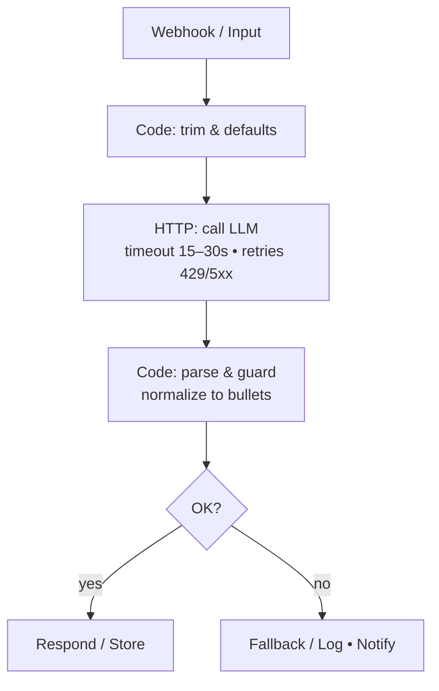

# AI Transform — Quick Start Guide

## Introduction

This document contains a pattern to enrich text with an LLM while keeping **cost** and **latency** predictable. Safe defaults, clear guardrails, and measurable outcomes.

## What you’ll build

You will create a **small, reproducible workflow** that accepts raw text, calls an LLM via HTTP, and returns a **normalized, bullet-point summary** that downstream nodes can trust. 

The flow is designed to be deterministic (low temperature), bounded in length (input cap), and **JSON-shaped** end-to-end.

## Deliverable

- A five-node pipeline: **Webhook → Code (prepare) → HTTP (AI call) → Code (post-process) → Respond/Store**.
- One reusable **input → output contract** and safe defaults (timeouts, retries, idempotency key).
- Observability hooks (correlation ID, optional token/latency fields) for later metrics.

## End-to-End diagram

## Prerequisites

- An HTTP-accessible LLM endpoint (e.g., your provider’s REST API).
- A secret/token stored in a secure credential (avoid hard-coding).
- Basic familiarity with the Code node and HTTP client.

## How to build a workflow

To build the workflow use the following guides:

1. [Prepare input (Code node)](../workflow/preparing-input.md)
2. [Call the model (HTTP client)](../workflow/http-client.md)
3. [Post-process & guardrails (Code node)](../workflow/post-process.md)
4. [Metrics to watch](../metrics/metrics.md)
5. [Troubleshooting](../troubleshooting/troubleshooting.md)

## After you build the workflow

- Pair with **HTTP retries & idempotency** for resilient calls.
- Add a **safety switch** (flag) to bypass AI on errors or budget caps.
- Expose **observability** (latency, valid JSON rate) on your metrics dashboard.

!!! warning "Important"
    Fill in provider-specific details (endpoint, headers, auth) where appropriate. Keep secrets in credentials, never in code.

!!! tip "Tip"
    You can also try to build a quick (under 10 minutes) workflow sample. To do this, please, refer to [Very Quick Quickstart](../workflow/quickstart.md).
