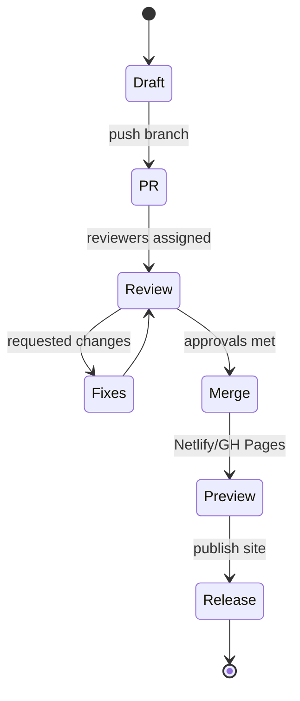

# Contributing (Docs)

## Branches & Commits
- Branch: `feat/*`, `fix/*`
- Commits: `docs: ...`, `feat(docs): ...`

## Pull Requests
- Clear title + short summary
- Screenshot of the rendered page
- Link to any related issue

## Local Checks
```bash
pip install -r requirements.txt
python -m mkdocs build --strict
vale .
```

### Style & Linting

- Prose: Vale (Microsoft style) and/or Lexi
- Links: lychee
- Keep sentences short
- Prefer active voice

### Review Expectations

- Small, focused PRs
- Actionable comments
- “Why” > “What” in descriptions

### CI/CD for Docs (State)


