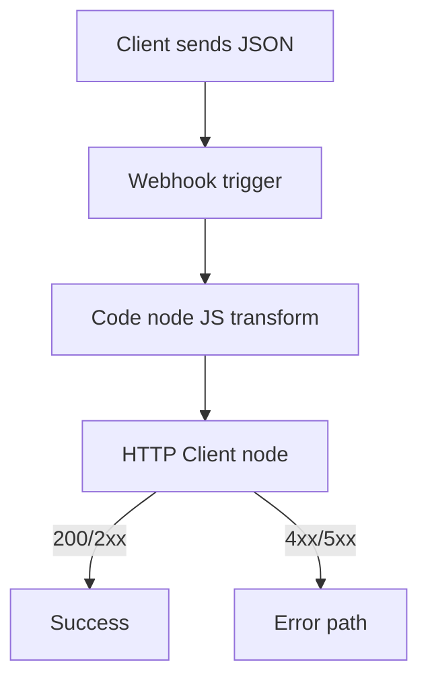
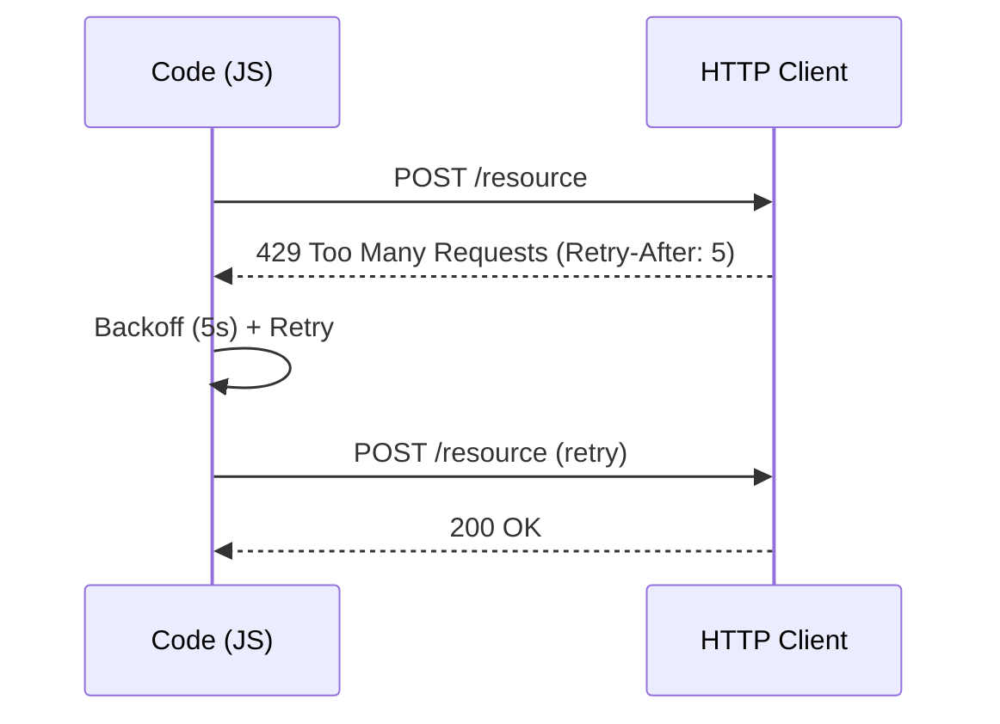
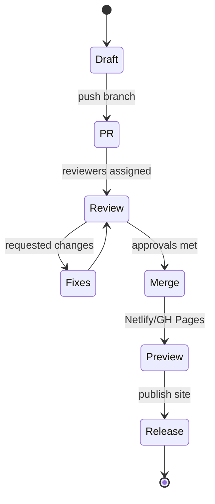

# Diagrams (Workflow Platform)

## End-to-End (Webhook → Code → HTTP Client)

```mermaid
flowchart TD
  A[Client sends JSON] --> B[Webhook trigger]
  B --> C[Code node JS transform]
  C --> D[HTTP Client node]
  D -->|200/2xx| E[Success]
  D -->|4xx/5xx| F[Error path]
```

## Error Handling Sequence (HTTP 429)

```mermaid
sequenceDiagram
  participant X as Code (JS)
  participant H as HTTP Client
  X->>H: POST /resource
  H-->>X: 429 Too Many Requests (Retry-After: 5)
  X->>X: Backoff (5s) + Retry
  X->>H: POST /resource (retry)
  H-->>X: 200 OK
```

## CI/CD for Docs (State)

```mermaid
stateDiagram-v2
  [*] --> Draft
  Draft --> PR: push branch
  PR --> Review: reviewers assigned
  Review --> Fixes: requested changes
  Fixes --> Review
  Review --> Merge: approvals met
  Merge --> Preview: Netlify/GH Pages
  Preview --> Release: publish site
  Release --> [*]
```
