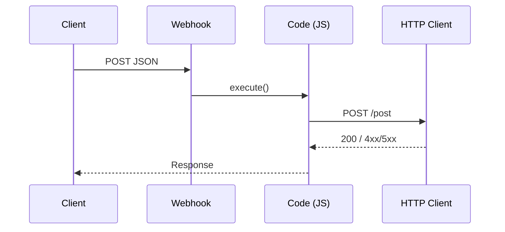

# Very Quick Quickstart (Workflow Platform)

> Goal: Build a minimal workflow (Webhook → Code → HTTP Client) in less than 10 minutes.

## 1) Create a Webhook trigger
1. Create a new workflow.
2. Add a **Webhook** trigger and enable a test URL.

## 2) Add a Code node (JavaScript)
Paste and save:
```javascript
return [
  {
    json: {
      message: 'hello',
      ts: new Date().toISOString(),
    }
  }
];
```

## 3) Add an HTTP Client node
- Method: `POST`
- URL: `https://httpbin.org/post`
- Body: `{{$json}}` (forward prior node output)

## 4) Run & test
Activate the workflow and send a request:
```bash
curl -X POST "$WEBHOOK_TEST_URL" \
  -H 'Content-Type: application/json' \
  -d '{"hello":"world"}'
```



### Troubleshooting
- 4xx/5xx: check URL, auth, body.
- No trigger: ensure test URL is active and the workflow is running.
